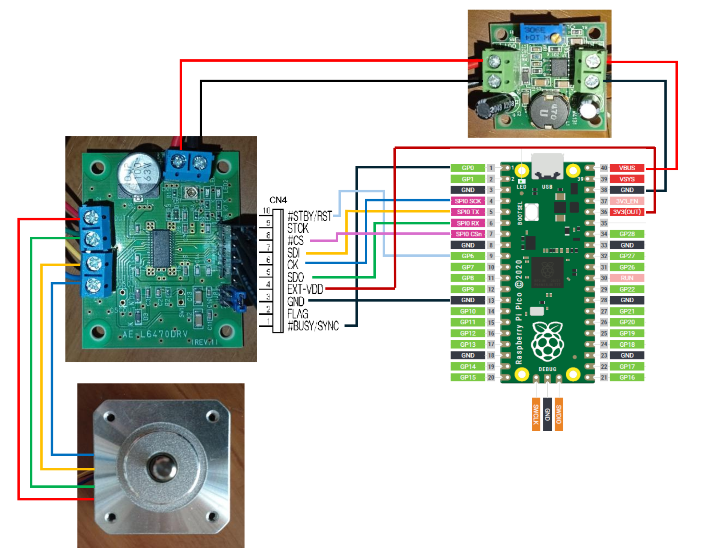

# L6470 MicroPython Driver (RP2040 / Raspberry Pi Pico)
English version → [README.md](README.md)

RP2040（Raspberry Pi Pico）上でL6470ステッピングモータードライバーを制御するためのMicroPythonライブラリ。
STMicroelectronics **L6470 ステッピングモータドライバ** を  
**Raspberry Pi Pico (RP2040) + MicroPython** から制御するための  
シンプルなドライバ実装です。

Pure MicroPython 実装で、SPI 経由で L6470 を直接制御します。

---

## 現在できること

- SPI（Mode3）による L6470 制御
- パラメータ設定（ACC / DEC / MAX_SPEED / KVAL など）
- RUN コマンドによる連続回転
- BUSY ピンによる動作同期
- USB 給電環境でも安定して回転
- 自動生成された `set_xxx()` / `get_xxx()` API が利用可能


---

## インストール方法

### 手動インストール


このライブラリは**MicroPython mip と互換性がありません**。
`mpremote` を使用して手動でインストールしてください。

1. このリポジトリを clone してください。
2. `l6470/ ディレクトリを Pico の /lib にコピーしてください。

#ライブラリ構成
```
/lib
├─ __init__.py
└─ l6470.py        # L6470 ドライバ本体
```

---

## インストール方法（mpremote 使用）

※ 本ライブラリは **MicroPython 標準の mip には未対応**です。  
GitHub から `mpremote` を使って Pico に転送してください。

### 1. githubから転送（Windows）

```
mpremote fs mkdir :/lib
mpremote mip install github:pukkunk/rp2040-l6470-micropython/l6470/__init__.py
mpremote mip install github:pukkunk/rp2040-l6470-micropython/l6470/l6470.py
```
### 2. サンプルプログラムを main.py として転送
```
mpremote fs cp example\minimal.py :/main.py
```
### 3. 実行（リセット）
```
mpremote reset
```

Pico 内の構成は以下になります。
```
:/
  main.py
/lib
    __init__.py
    l6470.py
```


```
##サンプル
# example/minimal.py
from machine import SPI, Pin
from l6470 import L6470
import time
from l6470 import (
    STEPMODE_SYNCEN_DISABLE,
    STEPMODE_SYNCSEL0,
    STEPMODE_STEPSEL_DIV1_128_MICROSTEP
)

spi = SPI(0, baudrate=1_000_000, polarity=1, phase=1, sck=Pin(2), mosi=Pin(3), miso=Pin(4))
cs = Pin(5, Pin.OUT, value=1)
busy = Pin(0, Pin.IN)
resetn = Pin(6, Pin.OUT, value=1)  # Pico GPIO6
motor = L6470(spi=spi, cs=cs, busy=busy, resetn=resetn)

# ------------------- パラメータ設定 -------------------
motor.set_ACC(0x05)        # ゆっくり立ち上げ
motor.set_DEC(0x05)        # ゆっくり停止
motor.set_MAX_SPEED(0x20)  # 上限を抑える（暴走防止）
motor.set_MIN_SPEED(0x00)  # 完全に停止可能
motor.set_FS_SPD(0x000)    # フルステップ遷移禁止

motor.set_KVAL_HOLD(0x50)
motor.set_KVAL_ACC(0x50)
motor.set_KVAL_RUN(0x40)
motor.set_KVAL_DEC(0x50)

# ------------------- ステップモード設定 -------------------
step_mode = (
    STEPMODE_SYNCEN_DISABLE |
    STEPMODE_SYNCSEL0 |
    STEPMODE_STEPSEL_DIV1_128_MICROSTEP
)
motor.set_param("STEP_MODE", step_mode)

# ------------------- モーター前進 -------------------
motor.run(L6470.FWD, 0x20)  # 安全低速で回転

# ------------------- 無限ループ -------------------
while True:
    time.sleep(1)
```

---

## 使用部品

- **Raspberry Pi Pico**
- **L6470 使用 ステッピングモータードライブキット**  
  - 秋月電子で購入
- **バイポーラー ステッピングモーター SM-42BYG011**  
  - 秋月電子で購入
- **最大 30V 出力 昇圧型スイッチング電源モジュール（NJW4131 使用）**  
  - 秋月電子で購入

## 接続

### Raspberry Pi Pico ⇔ L6470 キット（CN10）

| Raspberry Pi Pico | 機能    | L6470 キット CN10 |
|------------------|---------|-------------------|
| GP00             | BUSY    | 1PIN : #BUSY/SYNC |
| （未接続）       | FLAG    | 2PIN : FLAG |
| GP02             | SCK     | 6PIN : CK |
| GP03             | MOSI    | 7PIN : SDI |
| GP04             | MISO    | 5PIN : SDO |
| GP05             | CS      | 8PIN : #CS |
| GND              | GND     | 3PIN : GND |
| GP06             | RESETN  | 10PIN : #STBY/RST |
| 3V3 (OUT)        | 電源    | 4PIN : EXT-VDD |
| （未接続）       | STCK    | 9PIN : STCK |

---

### 昇圧型スイッチング電源 ⇔ L6470 キット（CN1）

| 昇圧型電源 | L6470 キット CN1 |
|-----------|------------------|
| 出力 +    | VS+ |
| GND       | GND |




## 動作環境

- Raspberry Pi Pico / RP2040
- MicroPython
- L6470 ステッピングモータドライバ

#ライセンス
MIT License
